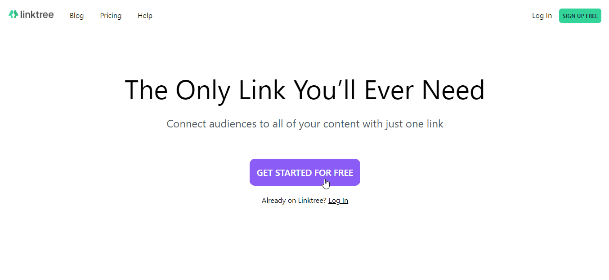

# 🔥linktree-clone



## 📖Sobre

"Clone" de algumas funcionalidades da plataforma Linktree, desenvolvido para praticar conceitos de frontend e backend.<br>
<a href="https://link3-clone.herokuapp.com" target="_blank">Disponível aqui</a>

## 🛠Tecnologias utilizadas

- Laravel
- VueJS
- TailwindCSS
- InertiaJS

## 🎮Rodando o projeto

```bash
composer update
php artisan migrate
npm install && npm run dev
php artisan serve
```
